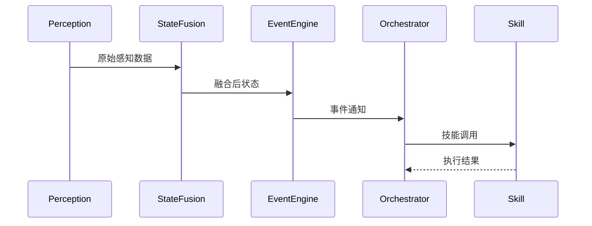

# 引擎架构

GameRuntime 引擎的详细架构设计文档。

---

## 整体架构

GameRuntime 采用事件驱动的微内核架构，核心由五大模块组成：

### 1. Perception（感知层）

多模态感知输入，支持：
- **OCR** — 文字识别
- **YOLO** — 目标检测
- **VLM** — 视觉语言模型融合

### 2. StateFusion（状态融合）

将多源感知数据融合为统一状态表示。

### 3. EventEngine（事件引擎）

基于事件驱动，处理状态变化触发的事件。

### 4. Orchestrator（编排器）

根据事件类型选择和编排对应的 Skill。

### 5. Skill（技能层）

可插拔的技能模块，执行具体游戏逻辑。

## 数据流

## 版本

当前版本：**v0.6.0**

状态：P0 重构完成，进入审计阶段。
