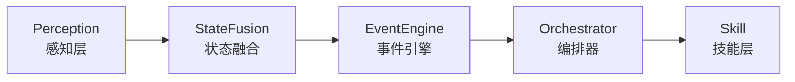

# GameRuntime 引擎

基于 Python 的游戏运行时系统，核心管线为 Perception → StateFusion → EventEngine → Orchestrator → Skill。

---

## 架构概览

## 子模块

| 模块 | 描述 | 状态 |
|------|------|------|
| Engine | 核心引擎 | P0 重构完成 |
| API | 对外接口 | 开发中 |
| Editor | 编辑器 | 开发中 |
| Agent | AI Agent | 开发中 |

## 相关文档

- [:material-sitemap: **引擎架构**](architecture.md) — 详细架构设计
- [:material-language-python: **Python 开发技巧**](python-tips.md) — 开发中遇到的坑和解决方案
