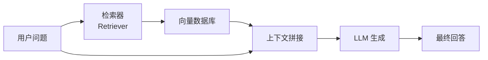

# RAG 技术

检索增强生成（Retrieval-Augmented Generation）相关笔记。

---

## 架构概览

## 核心组件

### 1. 文档处理

- 文档加载（PDF、Word、Markdown）
- 文本分块（Chunking）
- 向量化（Embedding）

### 2. 检索策略

- 稠密检索（向量相似度）
- 稀疏检索（BM25）
- 混合检索（Hybrid Search）

### 3. 生成优化

- Context Window 管理
- Reranker 重排序
- Citation 引用溯源

## 工具推荐

| 工具 | 用途 | 特点 |
|------|------|------|
| LangChain | RAG 框架 | 生态丰富 |
| LlamaIndex | 数据框架 | 索引能力强 |
| ChromaDB | 向量数据库 | 轻量易用 |
| Milvus | 向量数据库 | 高性能大规模 |
